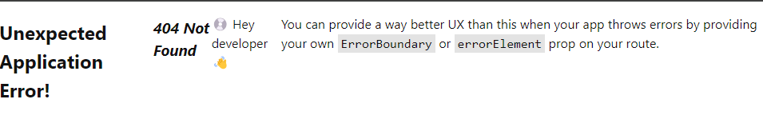

# Tutorial: React Router

## Descrição

- Repositório para projeto construído seguindo o tutorial contido na documentação oficial do React Router.
- fonte: https://reactrouter.com/en/main/start/tutorial#tutorial

## Sobre

-O React Router é uma <b>biblioteca</b> usada para criar aplicações de página única (SPAs) que simulam múltiplas páginas, gerenciando URLs e navegação sem recarregar a página.

- Em uma aplicação React, ao invés de carregar uma nova página do servidor a cada clique, o React Router manipula a troca de componentes exibidos conforme a URL muda, o que cria a sensação de múltiplas páginas.

## Passos

1) Instalação de projeto react via vite (passos do tutorial);
2) Iniciei repositório;
3) Deleção de arquivos desnecessários dentro do src, mantendo apenas contact.js, index.css, main.jsx
4) Configuração do main.jsx como entry point onde foi criado o Browser Router e criada a root route (a primeira rota, dentro da qual todas as outrsa renderizarão).
5) Criei pasta routes e criei componente root.jsx dentro dela, com código pronto providenciado pelo tutorial;
6) Estabeleci o componente Root como root route no main
7) Checar componente erro:

8) Criar melhor componente erro: error-page.jsx, e defini-lo como errorElement no root route

9) Criação de componentes correspondentes ao link (criar arquivo e estruturar seu html e css)

10) Linkar os componentes criados a suas rotas no main.jsx

    `import NovoElement from "path";

    {
    path: "NovoElement/:NovoElementId",
    element: <Contact />,
  },

  11) Nestagem dos novos componentes em main.tsx para renderizarem dentro do root layout

  12) Criação de outlet onde queremos que o conteudo renderizze

  13) Adicionar <Link> no root.jsx para cliques em links não fazerem um document request e apenas re-renderizar a UI. Substituir <a> por <Link to></Link>

  - dados

  14) Importar e usar getContacts no root.jsx

  15) Configurar o loader no main.jsx

## Aprendizado

- main.tsx é o entry point.

- root route é a primeira rota dentro da qual todas as outras renderizarão. É definido no main.tsx.

- um componente erro definido como ErrorElement no root route abarca todo tipo de comportamento inesperado como carregamento infinito, página não encontrada, etc.

- novas páginas = novos routes

- para os componentes puxarem data do servidor, usa-se duas APIs proprias da biblioteca: loader e useLoaderData